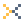
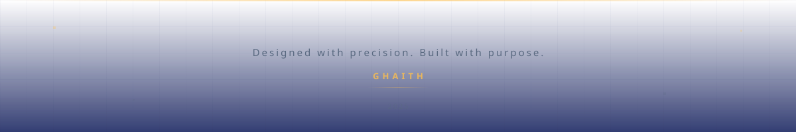

<!-- ═══════════════════════════════════════════════════════════════════════════════
     GITHUB PROFILE README — GHAITH
     Color Palette: #010E50 (Navy) | #58687F (Slate) | #FFC04B (Gold)
     Font: Montserrat
     ═══════════════════════════════════════════════════════════════════════════════ -->

<!-- ╔═══════════════════════════════════════════════════════════════════════════╗ -->
<!-- ║  ANIMATED BANNER                                                         ║ -->
<!-- ╚═══════════════════════════════════════════════════════════════════════════╝ -->

 

<!-- Tagline -->

  

<!-- ╔═══════════════════════════════════════════════════════════════════════════╗ -->
<!-- ║  DIVIDER                                                                 ║ -->
<!-- ╚═══════════════════════════════════════════════════════════════════════════╝ -->

 

<!-- ╔═══════════════════════════════════════════════════════════════════════════╗ -->
<!-- ║  ABOUT ME                                                                ║ -->
<!-- ╚═══════════════════════════════════════════════════════════════════════════╝ -->

<table>
<tr>
<td width="60" align="center">
  
</td>
<td>
  <h2>About Me</h2>
</td>
</tr>
</table>

**Full-Stack Developer & UI/UX Designer** — building products end-to-end, from pixel to backend.

<table>
<tr><td width="6" style="background-color: #FFC04B;"></td><td>

| | |
|---|---|
| **Currently working on** | a SaaS product for the local market |
| **Currently learning** | sharpening my UI/UX and frontend craft |
| **Looking to collaborate on** | frontend or full-stack projects with strong design |
| **Looking for help with** | scaling backend architecture |
| **Ask me about** | UI/UX, branding, or full-stack development |
| **Pronouns** | He/Him |
| **Fun fact** | I design the interface first, then build what runs behind it |

</td></tr>
</table>

 

 

<!-- ╔═══════════════════════════════════════════════════════════════════════════╗ -->
<!-- ║  TECH STACK                                                              ║ -->
<!-- ╚═══════════════════════════════════════════════════════════════════════════╝ -->

<table>
<tr>
<td width="60" align="center">
  
</td>
<td>
  <h2>Tech Stack</h2>
</td>
</tr>
</table>

#### Languages

  
  
  
  
  
  

#### Frameworks & Libraries

  
  
  

#### Databases

  
  

#### DevOps & Tools

  
  
  
  
  

#### Design & Productivity

  
  
  

 

 

<!-- ╔═══════════════════════════════════════════════════════════════════════════╗ -->
<!-- ║  GITHUB STATS — INFOGRAPHIC LAYOUT                                       ║ -->
<!-- ╚═══════════════════════════════════════════════════════════════════════════╝ -->

<table>
<tr>
<td width="60" align="center">
  
</td>
<td>
  <h2>GitHub Analytics</h2>
</td>
</tr>
</table>

<!-- Stats & Languages side by side -->
<table>
<tr>
<td align="center" width="50%">

</td>
<td align="center" width="50%">

</td>
</tr>
</table>

 

<!-- Streak Stats -->

  

<!-- Contribution Graph -->

 

 

<!-- ╔═══════════════════════════════════════════════════════════════════════════╗ -->
<!-- ║  CONNECT                                                                 ║ -->
<!-- ╚═══════════════════════════════════════════════════════════════════════════╝ -->

<table>
<tr>
<td width="60" align="center">
  
</td>
<td>
  <h2>Connect</h2>
</td>
</tr>
</table>

  
  &nbsp;&nbsp;
  
  &nbsp;&nbsp;
  

 

 

<!-- ╔═══════════════════════════════════════════════════════════════════════════╗ -->
<!-- ║  DEV QUOTE                                                               ║ -->
<!-- ╚═══════════════════════════════════════════════════════════════════════════╝ -->

 

<!-- ╔═══════════════════════════════════════════════════════════════════════════╗ -->
<!-- ║  PROFILE VIEWS & VISITOR BADGE                                           ║ -->
<!-- ╚═══════════════════════════════════════════════════════════════════════════╝ -->

 

<!-- ╔═══════════════════════════════════════════════════════════════════════════╗ -->
<!-- ║  FOOTER                                                                  ║ -->
<!-- ╚═══════════════════════════════════════════════════════════════════════════╝ -->

