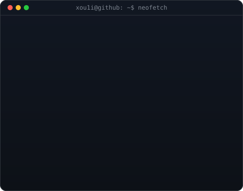
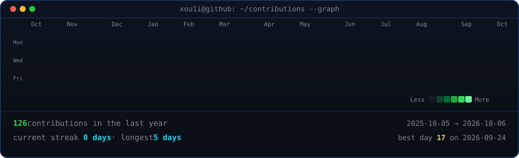

<table>
<tr>
<td valign="top"></td>
<td valign="top"></td>
</tr>
</table>

## Ghaith Ali

**Full-Stack Developer · Product & Brand Designer · Founder @ Prestige Agency**

`ʙᴇ ᴏʙꜱᴇꜱꜱᴇᴅ ᴏʀ ʙᴇ ᴀᴠᴇʀᴀɢᴇ`

 

<!-- animated contribution graph, refreshed daily by the workflow -->

